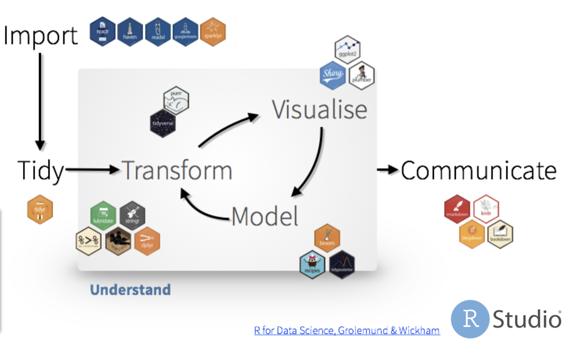

```{r setup, include=FALSE}
library(tidyverse)
library(lme4) # mixed models
library(car) # Anova
library(broom) # model diagnostics
library(emmeans) # Anova means
library(multcomp) # pairwise comparisons
library(multcompView) # you will need this for some tasks in multcomp 
library(wiqid)
knitr::opts_chunk$set(echo = TRUE)
```

***  

```{r analysis_tidywf, out.width=950, echo=FALSE}

```

## Exporatory data analysis  

1. Think about your problem. **What is the question**, how will it be answered?  

2. **Model fitting**  


## Model building - continuous variables   

* How is the data generated?  
* Generative statistical model  
  Example: yield response to density: quadratic function.  

## Continuous variable  
```{r quadratic}
quadratic <- function(x, a, b, c){
  mu <- a + b*x + c*x^2
  epsilon <- rnorm(length(x),0, sd = .1)
  y <- mu + epsilon
  return(y)
}

x <- seq(0,14, length.out = 100) #plants m2
y <- quadratic(x, 4, .5, -.026) # yield

my_data <- data.frame(x,y) 
```

***  

```{r plot quad}
my_data %>% 
  ggplot(aes(x,y))+
  geom_point()+
  theme_bw()+
  theme(aspect.ratio = .85)
```

***  

Do linear regression on that:  
```{r lr}
# lm function 
my_lm1 <- lm(y ~ 1 + x, data = my_data)

my_lm1_wointercept <- lm(y ~ x -1, data = my_data)

my_lm2 <- lm(y ~ 1 + x + I(x^2), data = my_data)
my_lm3 <- lm(y ~ 1 + x + I(x^2) + I(x^3), data = my_data)
summary(my_lm1) # 0.6412
summary(my_lm2) #  0.9817
summary(my_lm3) #  0.9816
Anova(my_lm1, my_lm2)
```

## Categorical variables  

```{r usda}
usda <- read.csv("../data/USDAsurvey_00-18.csv")

usda_linear1 <- lm(Value ~ State -1, data = usda)

usda_linear1
```

## 3. ANOVA  
**!!** What is the difference between `Anova()` and `anova()`?  
```{r anova differences}
# H0: all the states have the same mean
# H1: at least one of the states has a different mean
anova(usda_linear1) # default in R type I errors
Anova(usda_linear1, type = 3) # car package type II / III SS
```

***  
Model diagnostics  

```{r aug}
usda_linear1_aug <- augment(usda_linear1) # broom
usda_linear1_aug$.std.resid <- resid(usda_linear1, type="pearson", scaled=T)
```

***  

```{r std res}
usda_linear1_aug %>% 
  ggplot(aes(x=.fitted, y=.std.resid))+
  geom_hline(yintercept = c(-3,0,3), color="tomato")+
  geom_point(aes(color=State))+
  geom_smooth()
```

```{r Quantile-Quantile}
usda_linear1_aug %>% 
  ggplot(aes(sample=.std.resid))+
  stat_qq()+
  stat_qq_line()
```

***  

```{r emmeans}
usda_linear1_means <- emmeans(usda_linear1, specs = ~ State)

usda_linear1_cld <- cld(usda_linear1_means,
                       adjust = "none",
                       Letters = letters,
                       reversed = TRUE,
                       comparisons = TRUE)
```

***  

```{r usda_linear1_cld}
usda_linear1_cld <- usda_linear1_cld %>% as.data.frame() 
```

```{r}
usda_linear1_cld %>% 
  ggplot(aes(emmean, State))+
  geom_point()+
  geom_text(aes(label = .group))+
  labs(x = expression(Yield~(bu~acre^{-1})))
```

```{r gg}
usda_linear1_cld %>%
  ggplot(aes(emmean, State))+
  geom_errorbarh(aes(xmin = lower.CL, xmax = upper.CL), color = "grey70", height = .2)+
  geom_point()+
  geom_text(aes(label = .group, x = emmean + nchar(.group)*1.1), nudge_y = 0.1)+
  labs(x = expression(Mean~Yield~(Bu~acre^{-1})))+
  theme_bw()+
  theme(panel.grid.major.y = element_blank(),
        panel.grid.minor.y = element_blank())
```

***  

```{r usda_linear1_cld better}
# Remove the spaces from the character  
usda_linear1_cld$.group <- gsub(" ", "", usda_linear1_cld$.group, fixed = TRUE)

# Create a column "order" with the order of the State factor
usda_linear1_cld <- usda_linear1_cld %>%
  arrange(emmean) %>% 
  rownames_to_column("order") %>% 
  mutate(order = as.numeric(order))

levels(usda_linear1_cld$State)

# Reorder the states depending on their means
usda_linear1_cld <- usda_linear1_cld %>% 
  mutate(State = factor(State, levels = usda_linear1_cld$State[usda_linear1_cld$order]))
```
***  

```{r}
usda_linear1_cld %>%
  ggplot(aes(emmean, State))+
  geom_errorbarh(aes(xmin = lower.CL, xmax = upper.CL), color = "grey70", height = .2)+
  geom_point()+
  geom_text(aes(label = .group, x = emmean + nchar(.group)*1.1), nudge_y = 0.1)+
  labs(x = expression(Mean~Yield~(Bu~acre^{-1})))+
  theme_bw()+
  theme(panel.grid.major.y = element_blank(),
        panel.grid.minor.y = element_blank())
```

***  

```{r usda_linear1_cld better viz}
usda_linear1_cld %>%
  ggplot(aes(emmean, State))+
  geom_errorbarh(aes(xmin = lower.CL, xmax = upper.CL), color = "grey70", height = .2)+
  geom_point()+
  geom_text(aes(label = .group, x = emmean + nchar(.group)*1.1), nudge_y = 0.1)+
  labs(x = expression(Mean~Yield~(Bu~acre^{-1})))+
  theme_bw()+
  theme(panel.grid.major.y = element_blank(),
        panel.grid.minor.y = element_blank()) -> usda_linear1_ggplot; usda_linear1_ggplot
```

## Other possible models  
```{r other possible models}
class(usda$Year)

usda <- usda %>% mutate(fYear = as.factor(Year))
usda_linear1

usda_linear2 <- lm(Value ~ State + Year -1, data = usda)
usda_linear2
usda_linear3 <- lm(Value ~ State + fYear -1, data = usda)
usda_linear3

usda_linear4 <- lm(Value ~ State * Year -1, data = usda)

usda_linear5 <- lm(Value ~ State * fYear -1, data = usda)
```

## 4. Model selection  

**AIC**  

```{r}
AICtable(AIC(usda_linear1,
             usda_linear2,
             usda_linear3,
             usda_linear4,
             usda_linear5))

BIC(usda_linear1,
    usda_linear2,
    usda_linear3,
    usda_linear4,
    usda_linear5)
```

***  
Different statistical models...   
Different results...  
Different conclusions*  

## 5. Model-based model selection   

* Lasso regression  
* Ridge regression  
* Elastic net regression  
* Bayesian version: informative priors/regularized horseshoe priors  

## 6. Model-based inference  
*(describe a process with a mathematical function and derive conclusions from there)  
Grain filling  
Mueller et al. (2019) [paper](https://doi.org/10.1016/j.eja.2019.125939)  

## Trigger questions  

> **Derived quantities** (eg. Optimum plant density, or any tranformation of the parameters) **do not include uncertainty estimates. How do you determine wether the difference between 2 trt is statistically significant?** E.g. OPD of field 1 is different to OPD of field 2.  

> Usually, mechanistic model-based inference is preferrable because it can explain more things.  


## Linear Mixed Effects  
**Fixed effects**  
Effect ON the variable. (not affecting the error, just the expected Y value).   

**Random effects**  
* NOT AFFECTING the expected Y value.  
* Effect on the “variability” of the variable (Sigma).  
* Most basic component is the RESIDUALS (e) given by replications/repetitions.  
* Also BLOCKS.  

***  
```{r Expected marginal means}
options('contrasts')
options(contrasts = c("contr.sum", "contr.poly")) # set the contrasts
options('contrasts')

usda_mixed <- lmer(Value ~ State*fYear + (1|fYear), data = usda)

usda_mixed_means <- emmeans(usda_mixed, #~State|Year,
                      specs = pairwise ~ State)

```

***  

Random effects are iid ~ N(0,var1)  
```{r QQ plot for random effects}
randef <- ranef(usda_mixed)[[1]] 

randef %>% 
  ggplot(aes(sample=`(Intercept)`))+
  stat_qq()+
  stat_qq_line()
```

***  

```{r pairwise comp}
#Set up a compact letter display of all pair-wise comparisons
cld(usda_mixed_means,
    adjust = "none",
    Letters = letters,
    reversed = TRUE,
    comparisons = TRUE) -> usda_mixed_cld

# default plot 

# ggplot -> necessary steps ?
```

***  

```{r mixedeff}
usda_mixed_cld <- usda_mixed_cld %>% as.data.frame() 

usda_mixed_cld %>%
  ggplot(aes(emmean, State))+
  geom_point()+
  geom_text(aes(label = .group), nudge_y = 0, nudge_x = 3)

usda_mixed_cld$.group <- gsub(" ", "", usda_mixed_cld$.group, fixed = TRUE)

usda_mixed_cld <- usda_mixed_cld %>%
  arrange(emmean) %>% 
  rownames_to_column("order") %>% 
  mutate(order = as.numeric(order))

usda_mixed_cld <- usda_mixed_cld %>% mutate(State = factor(State, levels = usda_mixed_cld$State[usda_mixed_cld$order]))
# ggplot 
```

***  

```{r better mixedeff viz}
usda_mixed_cld %>%
  ggplot(aes(emmean, State))+
  geom_errorbarh(aes(xmin = asymp.LCL, xmax = asymp.UCL), color = "grey70", height = .2)+
  geom_point()+
  geom_text(aes(label = .group, x = emmean + nchar(.group)*1.2), nudge_y = 0.1)+
  labs(x = expression(Mean~Yield~(Bu~acre^{-1})))+
  theme_bw()+
  theme(panel.grid.major.y = element_blank(),
        panel.grid.minor.y = element_blank()) -> usda_mixed_ggplot; usda_mixed_ggplot 
```


# References  

* **Model building:** Check out Chapter 10 in *Hobbs, N. T., and Hooten, M. B. (2015). Bayesian models: a statistical primer for ecologists. Princeton University Press.*  

* [Dr. Leo Bastos 2019 R workshop](https://www.youtube.com/watch?v=8xyi9By3fM4)  
