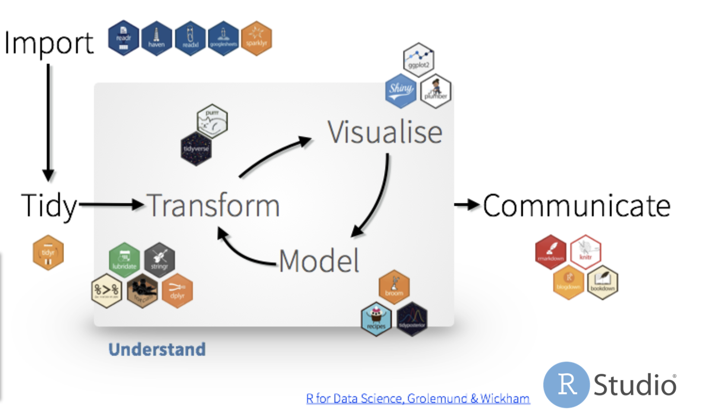

# Packages  

```{r libs}
library(tidyverse)
library(lme4)
library(daymetr)
```

```{r for loops}
paste("Hola me llamo Emma")
paste("Hola me llamo Jesi")
paste("Hola me llamo Fer")

i <- "Emma"
j <- 24
paste("Hola me llamo", i, "y tengo", j, "años")

i <- "Jesi"
j <- 84
paste("Hola me llamo", i, "y tengo", j, "años")

for (i in c("Emma", "Jesi", "Fer")) {
  print(paste("Hola me llamo", i))
}

weather <- data.frame()

for (i in 1:10) {
  print(paste0("C:/Users/Josefina/Documents/KSU/density_pred/data/weather/04192021/pptm_hist_", i, ".csv"))
}

for (i in 1:10) {
  weather <- weather %>% bind_rows(
    read.csv(paste0("C:/Users/Josefina/Documents/KSU/density_pred/data/weather/04192021/pptm_hist_", i, ".csv"))
)
}

```

# Map functions  

# Data  
```{r data}
soybeans <- readxl::read_xlsx("C:/Users/Josefina/Documents/GitHub/Rworkshop_2021/data/soybeans.xlsx", sheet = "Summary (2)") %>% 
  rename(yield = `Yield@13% bu/ac`, 
         pd = `Plant Date`,
         mg = Maturity) %>% 
  mutate(yield = as.numeric(yield),
         Loc = ifelse(Loc=="North_Farm", "Manhattan", Loc))
colnames(soybeans)
str(soybeans)
getwd()
```

```{r set theme}
theme_set(theme_classic())
```

```{r viz1}
# devtools::install_github("karthik/wesanderson")
soybeans %>% 
  ggplot(aes(DOY, yield))+
  geom_point(aes(fill = Weight),shape = 21)+
  scale_fill_gradientn(colours = wesanderson:: wes_palette(
    "Zissou1", 100, type = "continuous"))+
  theme(aspect.ratio = .85,
                axis.title = element_text(size=14))
```

```{r viz2}
soybeans %>% 
  ggplot(aes(DOY, yield))+
  geom_point(aes(fill = factor(Year)),shape = 21)+
  facet_wrap(~Loc)+
  scale_fill_manual(values = wesanderson::wes_palette("FantasticFox1"))+
  theme(aspect.ratio = .85,
                axis.title = element_text(size=14))
```


```{r coords}
coords <- data.frame(Loc = c("Manhattan", "Ottawa","Topeka","Parsons"),
                     lat =c(39.217795, 38.538687, 39.07612, 37.220435),
                     lon = c(-96.598682,-95.241784,-95.768379,-95.171074))
#join dfs
soybeans <- soybeans %>% right_join(coords)
```

# Set the locations in a map  

```{r must ex}
library(sf)
usa <- st_as_sf(maps::map("state", fill=TRUE, plot =FALSE))

ggplot(usa) +
  geom_sf(color = "#2b2b2b", fill = "white", size=0.125) +
  geom_point(data = coords, aes(x = lon, y = lat), 
             size = 4, shape = 23, fill = "darkred")+
  coord_sf(ylim = c(36.5,41),xlim=c(-102.5,-94), expand = FALSE)
```

## Map functions  
```{r}
download_daymet(site = "Manhattan",
                lat = 39.217795,
                lon = -96.598682,
                start = 2019,
                end = 2020,
                internal = TRUE,
                simplify = TRUE)
```

```{r map f}
weather <-  soybeans %>% 
  dplyr::select(Loc, Year, lat, lon) %>% 
  mutate(year2 = Year +1) %>% 
  drop_na(lat) %>%
  unique() %>% 
  mutate(weather = pmap(.l = list(Loc, lat, lon, Year),
                        .f = ~download_daymet(site = ..1,
                                              lat = ..2,
                                              lon = ..3,
                                              start = ..4,
                                              end = ..4+1,
                                              internal = TRUE,
                                              simplify = TRUE))) %>% 
  ungroup()

weather <- weather %>%
  unnest(weather)

weather$measurement %>% unique()

weather %>% 
  pivot_wider(values_from = value,
              names_from = measurement)
```

```{r}
m1 <- lm(yield~ Loc*Year, data =soybeans)
lm(Weight~ Loc*Year, data =soybeans)

lms <- soybeans %>% 
  pivot_longer(cols = c(yield, Weight)) %>% 
  group_by(Loc, name) %>% 
  nest() %>% 
  mutate(model = data %>% map(~lm(value~ Year, data =.)))
```

# Save many dataframes  

# Wrapup  
```{r analysis_tidywf, out.width=950, echo=FALSE}

```

